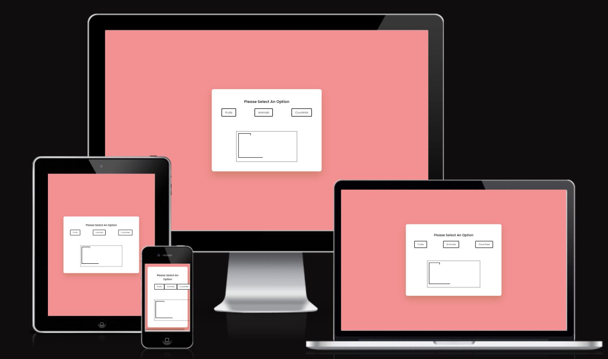
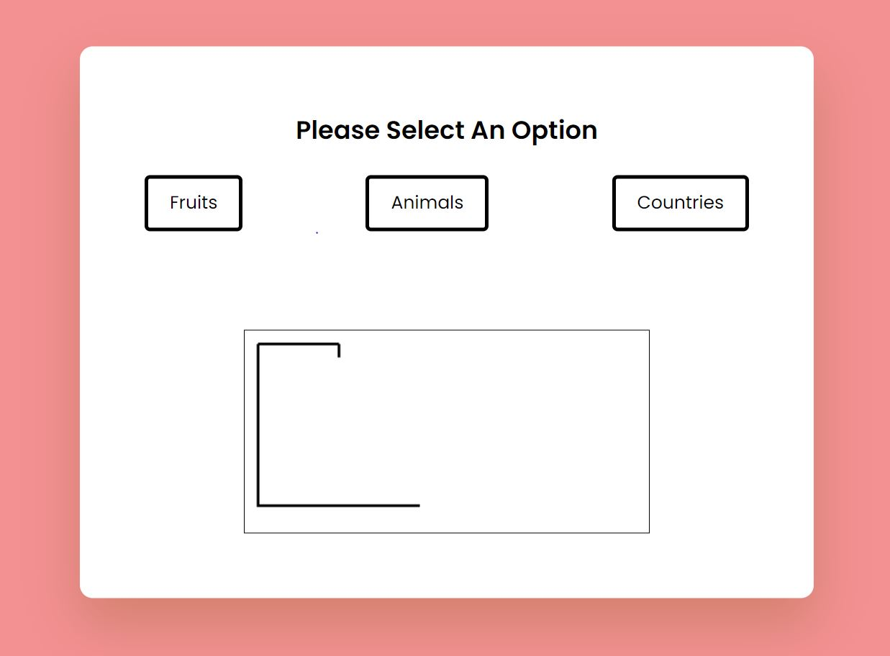
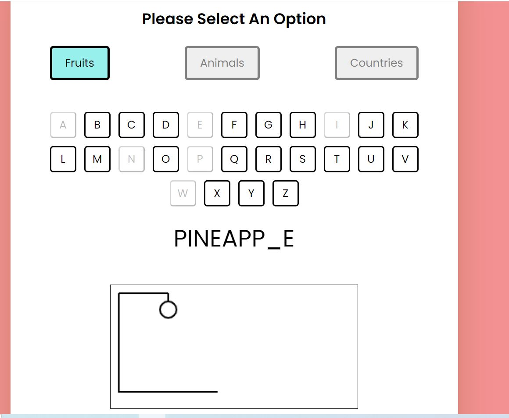
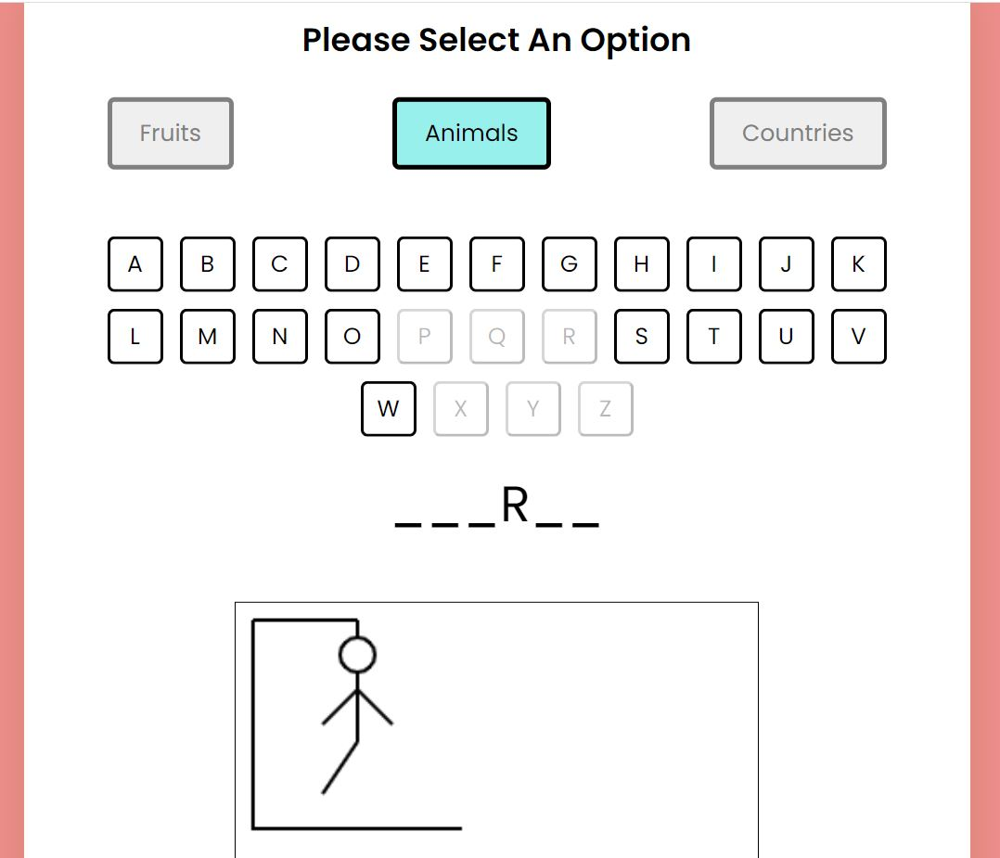
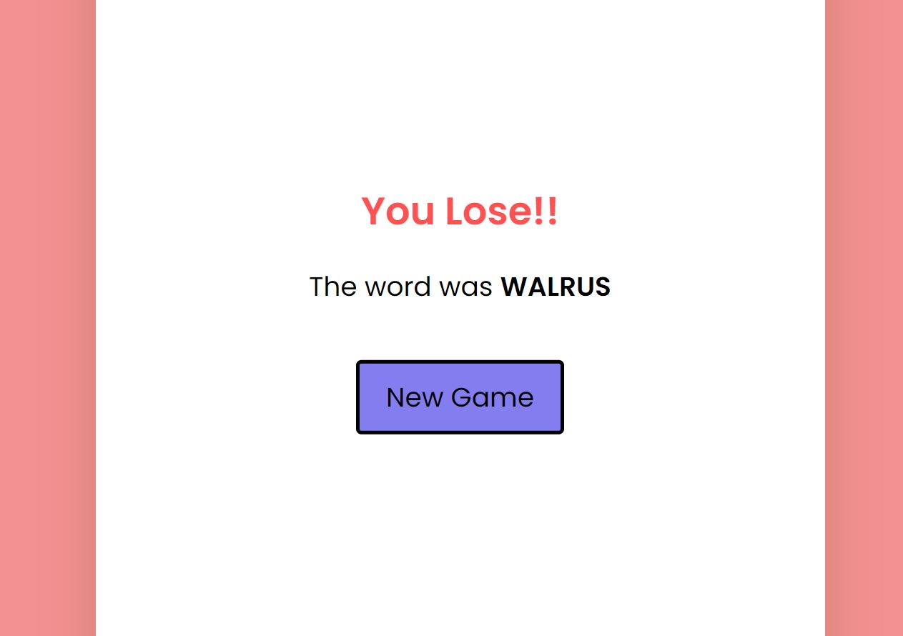
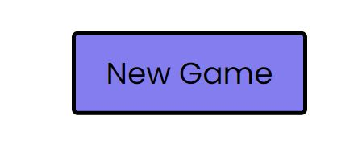

# Hangman

Hangman is a game which runs on Javascript.

Hangman is a word guessing game. This started out as a paper-and-pencil game that can involve two or more players. One player will think of a word, phrase or sentence and the other player(s) will try to guess the word within a certain number of guesses. Each incorrect guess will cause an element of hangman being drawn. If the players guess the word before the drawing is complete they win, otherwise they lose to the player who set the word.

In this game the user plays against the computer which will generate a random word to be guessed. Instructions are provided in the game to teach the user how to play.

[Link to Hangman game](https://amardange.github.io/Hangman-quiz/)

* [How to play](#How-to-play)
* [User Experience (UX)](#User-Experience-(UX))
  * [Initial Discussion](#Initial-Discussion)
  * [User Stories](#User-Stories)

* [Design](#Design)
  * [Colour Scheme](#Colour-Scheme)
  * [Graphics](#Graphics)
  
  
* [Features](#Features)

* [Technologies Used](#Technologies-Used)
  * [Languages Used](#Languages-Used)
  * [Frameworks, Libraries & Programs Used](#Frameworks,-Libraries-&-Programs-Used)

* [Testing](#Testing)
  * [Solved Bugs](#Solved-Bugs)
  * [Manual Testing](#Manual-Testing)

* [Deployment](#Deployment)
  * [Local Deployment](#Local-Deployment)
  * [Remote Deployment](#Remote-Deployment)
  * [Deploy project to javascript](#Deploy-project-to-javascript)
  
* [Credits](#Credits)
  * [Code](#Code)
  * [Content](#Content)
  * [Acknowledgements](#Acknowledgements)

- - -

## How to play

The object of the game is to figure out the unknown word by guessing letters. 

The length of the word is explicitly stated and is marked by underscores for each letter to be guessed. 
If the letter guessed by the user is in the unknown word it will display by replacing the underscores wherever the letter occurs.

If the guessed letter is not in the unknown word the user will lose a try. This will correspond to a person on the gallow being drawn, one part for each incorrect letter guessed. 
i.e. in the order: head, body, left arm, right arm, left leg, right leg.

As such the user will have to guess the word before the drawing is complete and they are hanged.
If the user successfully guesses the word before they run out of tries they win the game.

To assist the user, a hint is provided that words to be guessed in this game are animals.

- - -

## User Experience (UX)

### Initial Discussion
In this hangman game the user plays against the computer to guess the word and win the game before they run out of tries and are hanged. 

The target audience is anyone interested in playing a game of hangman. This could be a familiar childhood game for some but there are instructions provided for those who are new to the game.

#### Key information:
* Win or lose the user is given an option to play again

### User Stories

#### Client Goals
* To entertain users
* To be able to learn how to play
* To make it easy for users to interact with the game
* To be clearly informed of invalid input and how to proceed
* Win or lose, to play the game to completion without issue
* To be able to choose to play again or quit

#### First Time Visitor Goals
* I want to be able to learn how to play.
* I want to be informed on what the issue is if an invalid input is made.
* I want to be given instant feedback if a correct or incorrect guess is made.
* I want to be able to guess the full word if I think I know what it is.
* I want to be informed when the game is over, if I've won or lost.
* I want to be able to play again or quit.

#### Returning Visitor Goals
* I want to be able to play the game multiple times with a new word.

- - -

## Design

### Colour Scheme
The termcolor module was used to print colored text.

Bright and bold colors were used throughout the game to draw the users attention for a specific purpose or engagement.

Color consistancy is used in the below instances:
* Pink is used largely when requesting user input.
* Black is used largely when the user's chosen name is called alongside text to draw their attention.

### Graphics
* ASCII art was taken from [Texteditor](https://texteditor.com/gallery/)
* Hangman array was taken from Invent with Javacript.(LINK)

## Features
Below are the main features the user will come across when playing the game. The terminal is cleared each time to make it clean and prevent confusion if the user starts to scroll. The purposeful use of colors as explained in the design section, is also evidenced below.

1. Once the user chooses to play the game, the computer will:
* provide the window with three diffrent options,

2. User has to select one option(from fruits, Animals, Country)to start game.
  If the user guess is correct, clear feedback is provided confirming the letter is in the word. The word to be guessed is updated for that letter wherever it occurs in the word replacing the underscore(s).

3. If the user guess is incorrect, clear feedback is provided confirming the letter is not in the word. The incorrect guess is added to "Incorrect guesses: ", the hangman image is updated and the user is updated on the number of attempts they have left to guess the word.

4. If the user runs out of tries, game over is displayed with the hangman image completed. The user is informed of the complete word to provide them with some resolution. 

5. If the user guesses all the correct letters while they have tries remaining, they win the game. They are rewarded with a win message confirming what the word was. 

6. Whether the user wins or loses, the will computer follow up to provide instructions on how the user can proceed if they want quit or play again.

- - -

## Technologies Used

### Languages Used
- [HTML](https://en.wikipedia.org/wiki/HTML)
- [css](https://en.wikipedia.org/wiki/CSS)
- [Javascript](https://en.wikipedia.org/wiki/JavaScript)

### Frameworks, Libraries & Programs Used
- font awesome: the icon of the Poppins is from Font awesome
- Git: Git was use commit and push to github
- GitPod: Gitpod was used as the development environment for this project. In order to 
  track development stage and version control regular commits and pushes to GitHub has been made. The GitPod environment was created using a template provided by Code Institute.
- GitHub: Github was used to deploy the site and store it

- - -

## Testing 
Issues raised in my project meetings with my mentor 

1. It was suggested that to improve user experience, the user should be able to guess the full word if they think they know what the word is, rather than enter letter by letter to complete the word. The ask_for_input function was updated to account for this, which made for a better user experience. 

### Solved Bugs

1. Correct guesses were not displaying to the word. After consulting with my mentor and adding print statements, the issue became apparent (see credits). The equality between WORD and guess was failing as WORD was not printing in capitalised letters, like guess. Therefore, WORD.upper() was used to resolve this.

3. The incorrect guesses were displaying above the game over display for when the user uses all tries and is hanged.

This was resolved by simply adding an if statement so that when TRIES = 0 this is not displayed to the game over screen.

### Manual Testing

#### responsiveness
The website is adapted to be seen on different screen sizes. The responsiveness of the website was first tested by chrome developer tools. Different breakpoints where used to view the website. Next to this the website was viewed on different devices: laptop, tablet and smartphones.

- - -

## Deployment 

### Local Deployment

#### How to Clone

#### How to Fork
1. Sign up or log in to GitHub
2. Go to the repository 
3. Click on the fork button towards the top right of the page 

### Remote Deployment
The website was deployed to GitHub Pages as follows:
1. Log in to GitHub
2. Assuming you have cloned or forked the repository, go on the "Settings" link for this repository
3. Click on the "Pages" link on the left hand side of the page
4. Under "Source" select "Deploy from branch" from the dropdown
5. Under "Branch" select "main" from the dropdown
6. Click "Save" which will then refresh the page
7. It might take a few mins before you can refresh and view the link to the site published

### Deploy project

- - -

## Credits

### Code

### Content

### Acknowledgements 
Thank you to anyone taking the time to view my third project. Special thanks to the Slack community and the below individuals:

