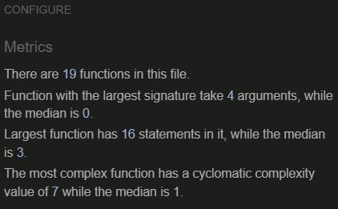

# Hangman

Hangman is a game which runs on Javascript.

Hangman is a word guessing game. This started out as a paper-and-pencil game that can involve two or more players. One player will think of a word, phrase or sentence and the other player's will try to guess the word within a certain number of guesses. Each incorrect guess will cause an element of hangman being drawn. If the players guess the word before the drawing is complete they win, otherwise they lose to the player who set the word.

In this game the user plays against the computer which will generate a random word to be guessed. Instructions are provided in the game to teach the user how to play.

[Link to Hangman game](https://amardange.github.io/Hangman-quiz/)

* [How to play](#How-to-play)
* [User Experience (UX)](#User-Experience-(UX))
  * [Initial Discussion](#Initial-Discussion)
  * [User Stories](#User-Stories)

* [Design](#Design)
  * [Colour Scheme](#Colour-Scheme)
  
  
* [Existing Features](#Existing-Features)

* [Technologies Used](#Technologies-Used)
  * [Languages Used](#Languages-Used)
  * [Frameworks, Libraries & Programs Used](#Frameworks,-Libraries-&-Programs-Used)

* [Testing](#Testing)
  * [Fixed Bugs](#Fixed-Bugs)
  * [Unfixed Bugs](#Unfixed-Bugs)
  * [Manual Testing](#Manual-Testing)
  * [Validator Testing](#Validator-Testing)

* [Deployment](#Deployment)
  
* [Credits](#Credits)
  * [Code](#Code)
  * [Acknowledgements](#Acknowledgements)

- - -

## How to play

The object of the game is to figure out the unknown word by guessing letters within three options (fruits, Animal, Countries). 

The length of the word is explicitly stated and is marked by underscores for each letter to be guessed. 
If the letter guessed by the user is in the unknown word it will display by replacing the underscores wherever the letter occurs.

If the guessed letter is not in the unknown word the user will lose a try. This will correspond to a person on the gallow being drawn & also payer will lose a chance, one part for each incorrect letter guessed. 
i.e. in the order: head, body, left arm, right arm, left leg, right leg and chances left option will be decrease by a number.

As such the user will have to guess the word before the drawing is complete and they are hanged.
Also user has to complete the game within Timer of 60 second.
If the user successfully guesses the word before they run out of tries they win the game.

To assist the user, a hint is provided that words to be guessed within the option for example if he/she has selected option animals then he/she can think about word from only names of animal and same is applicable for remaining option.

- - -

## User Experience (UX)

### Initial Discussion
In this hangman game the user plays against the computer to guess the word and win the game before they run out of tries, time and are hanged. 

The target audience is anyone interested in playing a game of hangman. This could be a familiar childhood game for some but there are instructions provided for those who are new to the game.

#### Key information:
* Win or lose the user is given an option to play again

### Goals

#### A. Client Goals
 1. To entertain users
 2. To be able to learn how to play
 3. To make it easy for users to interact with the game
 4. To be clearly informed of invalid input and how to proceed
 5. Win or lose, to play the game to completion without issue
 6. To be able to choose to play again or quit

#### B. First Time Visitor Goals
 1. I want to be able to learn how to play.
 2. I want to be informed on what the issue is if an invalid input is made.
 3. I want to be given instant feedback if a correct or incorrect guess is made.
 4. I want to be able to guess the full word if I think I know what it is.
 5. I want to be informed when the game is over, if I've won or lost.
 6. I want to be able to play again or quit.

#### C. Returning Visitor Goals
 1. I want to be able to play the game multiple times with a new word.

- - -

## Design

### Colour Scheme
The termcolor module was used to print colored text.

Bright and bold colors were used throughout the game to draw the users attention for a specific purpose or engagement.

Color consistancy is used in the below instances:
* Blue is used largely to start a game page
* Pink is used largely when requesting user input.
* Black is used largely when the user's chosen name is called alongside text to draw their attention.

## Existing Features
Below are the main features the user will come across when playing the game. The terminal is cleared each time to make it clean and prevent confusion if the user starts to scroll. The purposeful use of colors as explained in the design section, is also evidenced below.

### Start Button Page
 - Once the user chooses to Start the game, the computer will dsiplay below screen

Start Button

### Game Option Page
 - When user clicked on "Start" Button then second page will apppear with three option i.e. Fruits, Animal, Countries.
 - Also user can see Hangman draw window below of alphabet letters.

Game Option Page

### Select Option Button
 - User has to select one option from fruits, Animals, Country to play game.
 - Once user select one option then window will show all alphabets to select word
 - Also timer of 60 second and chances left tab will be appear.
 

Option Page

### Correct word guess
 - If the user guess is correct, clear feedback is provided confirming the letter is in the word. The word to be guessed is updated for that letter wherever it occurs in the word replacing the underscore's.

Correct Guess

### Incorrect word guess
 - If the user guess is incorrect, clear feedback is provided confirming the letter is not in the word. The incorrect guess is added to "Incorrect guesses: ", the hangman image is updated and the user is updated on the number of attempts they have left to guess the word.

Incorrect Guess

### Chances Left
 - If the user runs out of tries, game over is displayed with the hangman image completed & chances left will be zero. The user is informed of the complete word to provide them with some resolution. 

Chances Left

### Run out of time
4. If the user runs out of time with 60 second, game over is displayed with the hangman image completed. The user is informed of the complete word to provide them with some resolution.

Run out of time

### Win Game
 - If the user guesses all the correct letters while they have tries & time remaining, They are rewarded with a win message confirming what the word was. 

Win Game

### Lose Game
 - Whether the user loses the game, then computer will show follow up window with Lose game messsage and Correct answer will be displayed. Also "new game" button will be displayes

Lose Game

### New Game Button
 - Whether the user wins or lose the game and user wants to play it again, then there is "New Game" button option is provided and user can be proceed if they want to play game again.

New Game

 

- - -

## Technologies Used

### Languages Used
- [HTML](https://en.wikipedia.org/wiki/HTML)
- [CSS](https://en.wikipedia.org/wiki/CSS)
- [Javascript](https://en.wikipedia.org/wiki/JavaScript)

### Frameworks, Libraries & Programs Used
- [Am I responsive?](https://ui.dev/amiresponsive) - to show game across a range of devices.
- font awesome: the icon of the Poppins is from Font awesome
- Git: Git was use to commit and push to github
- GitPod: Gitpod was used as the development environment for this project. In order to 
  track development stage and version control regular commits and pushes to GitHub has been made. The GitPod environment was created using a template provided by Code Institute.
- GitHub: Github was used to deploy the site and store it

- - -

## Testing 
Issues discussed in my project with my code institute colleagues. 

1. It was suggested that to improve user experience, the user should be able to guess the full word if they think they know what the word is, rather than enter letter by letter to complete the word. They ask_for_input function was updated to account for this, which made for a better user experience. 

### Fixed Bugs

1. The incorrect guesses were displaying above the game over display for when the user uses all tries and is hanged.
  This was resolved by simply adding an if statement so that when TRIES = 0 this is not displayed to the game over screen.

2. On mobile device responsiveness is not good so as per suggestion by my mentor I use justify-content space-around and give canvas width 100% and now it is working on mobiles very nicely.

### Manual Testing

#### responsiveness
The website is adapted to be seen on different screen sizes. The responsiveness of the website was first tested by chrome developer tools. Different breakpoints where used to view the website. Next to this the website was viewed on different devices: laptop, tablet and mobile.

- - -
#### Validator Testing

1. HTML No errors where found by the official [W3C validator](https://validator.w3.org/nu/?doc=https%3A%2F%2Famardange.github.io%2FHangman-quiz%2Findex.html)
2. CSS No errors where found by the official [Jigsaw validator](https://jigsaw.w3.org/css-validator/validator?uri=https%3A%2F%2Famardange.github.io%2FHangman-quiz%2Fstyle.css)
3. JSHint No errors where found by the official JSHint validator
  

## Deployment 

The live version of the project is deployed at GitHub pages.

The procedure for deployment followed the "Creating your site" steps provided in GitHub Docs.

1. Log into GitHub.
2. Locate the GitHub Repository that shall be deployed live.
3. At the top of the repository, select Settings from the menu items.
4. Scroll down the Settings page to the ”GitHub Pages" section and click on the ”Check it out here!”
5. At the ”Source” section choose ”main” as Branch and root as folder and click ”Save”
6. The website will deploy and the pages refreshes to provide the live link to the project.
  The link can be found here: https://amardange.github.io/Hangman-quiz/

- - -

## Credits

### Code

- The basic code used was taken from a youtube tutorial from Mithali with a bunch of alterations.
- On the website of the w3schools I found a lot of information and codes for bugs and small changes to make.
- Varies parts of the website were inspired by the love math walkthrough project from Code institute.

### Acknowledgements 
Thank you to anyone taking the time to view my second project. Special thanks to the Slack community.
